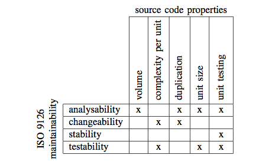

SIG Maintainability Model
=========================

This SIG Maintainability Model implementation is based on a paper: A Practical Model for Measuring Maintainability, In proceedings of the 6th International Conference on the Quality of Information and Communications Technology (QUATIC 2007), pages 30-39, IEEE Computer Society Press, 2007, http://dx.doi.org/10.1109/QUATIC.2007.8

This implementation is written in Rascal, see: http://www.rascal-mpl.org

To Summarize how the model:

1. It relates software quality model defined by ISO 9126 standard with the source code properties
2. It calculate the following metrics:
  * Volume
  * Complexity per unit
  * Duplication
  * Unit size
  * Unit testing
3. See image below to see the relation between ISO 9126 model with SIG maintainability model, taken from the papermentioned above.

